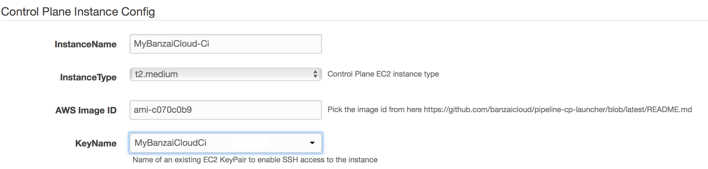
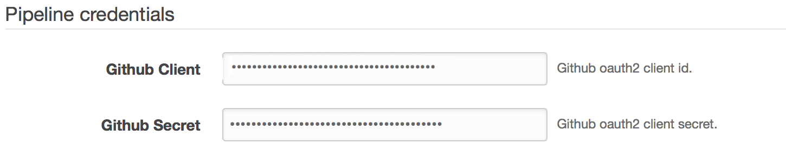
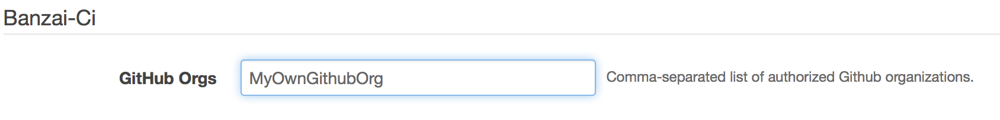
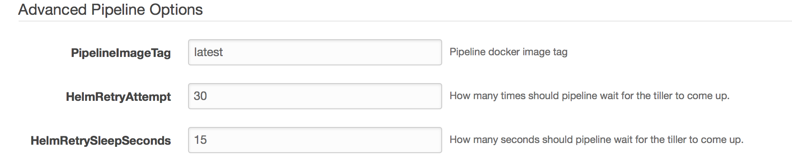

# Hosting Pipeline Control Plane on AWS

Follow the steps below for hosting `Pipeline Control Plane` on `AWS`.
On `AWS` we use a [Cloudformation](https://aws.amazon.com/cloudformation/) template in order to provision a Pipeline control plane.

The control plane image (AMI) is currently published to one region, `eu-west-1` aka Ireland. When launching the control plane please pass the following ImageId `ami-ece5b095`.

## Pre-requisites

1. [AWS](https://portal.aws.amazon.com/billing/signup?type=enterprise#/start) account
1. AWS [EC2 key pair](http://docs.aws.amazon.com/AWSEC2/latest/UserGuide/ec2-key-pairs.html)

## Command line

For creating the control plane launcher through command line take a look at `.env.example` as a start to learn what environment variables are required by the `Makefile`. _Note_ the makefile uses `aws` cli which needs to be installed first if not available on the machine.

* deploy - `make create-aws`
* delete - `make terminate-aws`

## Amazon Web Console

* Initiate the creation of a new stack: 

* Select `Specify an Amazon S3 template URL` and add the URL to our template `https://s3-eu-west-1.amazonaws.com/cf-templates-grr4ysncvcdl-eu-west-1/2018079qfE-new.templateejo9oubl16`

  

* Fill in the following fields on the form:

  * **Stack name**
    * specify a name for the Control Plane deployment

      

  * **AWS Credentials**
     * Amazon access key id - specify your [access key id](http://docs.aws.amazon.com/general/latest/gr/aws-sec-cred-types.html#access-keys-and-secret-access-keys)
     * Amazon secret access key - specify your [secret access key](http://docs.aws.amazon.com/general/latest/gr/aws-sec-cred-types.html#access-keys-and-secret-access-keys)

     

  * **Control Plane Instance Config**
     * InstanceName - name of the EC2 instance that will host the Control Plane
     * ImageId - `ami-ece5b095`
     * KeyName - specify your AWS [EC2 key pair](http://docs.aws.amazon.com/AWSEC2/latest/UserGuide/ec2-key-pairs.html)

     

  * **Pipeline Credentials**
     * Github Client - GitHub OAuth `Client Id`
     * Github Secret - Github OAuth `Client Secret`

      

  * **Banzai-Ci**
     * Orgs - comma-separated list of Github organizations whose members to grant access to use Banzai Cloud Pipeline's CI/CD workflow

      

  * **Grafana Dashboard**
     * Grafana Dashboard Password - specify password for accessing Grafana dashboard with defaults specific to the application

     

  * **Prometheus Dashboard**
     * Prometheus Password - specify password for accessing Prometheus that collects cluster metrics

      

  * **Advanced Pipeline Options**
     * PipelineImageTag - specify `0.3.0` for using current stable Pipeline release.

     

  * **Slack Credentials**
       * this section is optional. Complete this section to receive  cluster related alerts through a [Slack](https://slack.com) push notification channel.

  * **Alert SMTP Credentials**
     * this section is optional. Fill this section to receive cluster related alerts through email.

* Finish the wizard to create a `Control Plane` instance.

## Deployment end points

Check the output section of the deployed cloud formation template for the endpoints where the deployed services can be reached:

* PublicIP - the IP of the host where Pipeline is running
* Pipeline - the endpoint for the Pipelne REST API
* Grafana - the endpoint for Grafana
* PrometheusServer - the endpoint for [federated](https://banzaicloud.com/blog/prometheus-federation/) Prometheus server.

