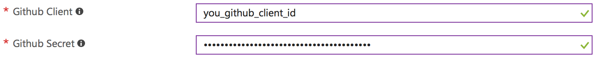
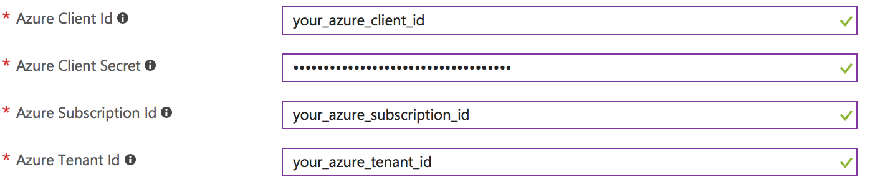
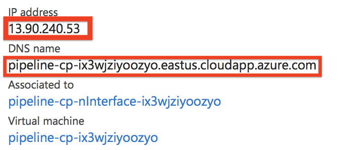
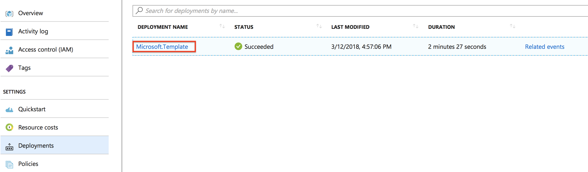
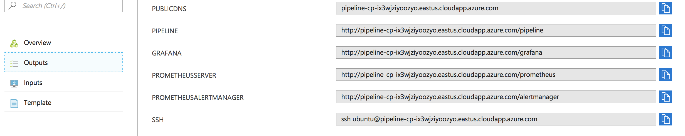

# Hosting Pipeline Control Plane on Azure

Follow the steps below for hosting `Pipeline Control Plane` on `Azure`.
On `Azure` we use a [ARM](https://docs.microsoft.com/en-us/azure/azure-resource-manager/resource-group-overview) template in order to provision a Pipeline control plane.

## Pre-requisites

1. [Azure](https://portal.azure.com) subscription with AKS service enabled.
1. Obtain a Client Id, Client Secret and Tenant Id for a Microsoft Azure Active Directory. These information can be retrieved from the portal, but the easiest and fastest way is to use the Azure CLI tool.<br>  
   
```bash
$ curl -L https://aka.ms/InstallAzureCli | bash
$ exec -l $SHELL
$ az login
```

Create a `Service Principal` with `owner` role for the Azure Active Directory using the following command.
> The `owner` role is needed to assign role(s) to Virtual Machines

```bash
$ az ad sp create-for-rbac --role 'owner'

```

You should get something like:

```json
{

  "appId": "1234567-1234-1234-1234-1234567890ab",
  "displayName": "azure-cli-2017-08-18-19-25-59",
  "name": "http://azure-cli-2017-08-18-19-25-59",
  "password": "1234567-1234-1234-be18-1234567890ab",
  "tenant": "7654321-1234-1234-ee18-9876543210ab"
}
```

* `appId` is the Azure Client Id
* `password` is the Azure Client Secret
* `tenant` is the Azure Tenant Id

In order to get Azure Subscription Id run:

```sh
az account show --query id
```

## Command line

For creating the control plane launcher through command line take a look at `.env.example` as a start to learn what environment variables are required by the `Makefile`. **Note**: Make sure to log in to Azure prior using the command line with `az login` !

* deploy - `make create-azure`
* delete - `make terminate-azure`

## Azure Web Portal

* Navigate to: https://portal.azure.com/#create/Microsoft.Template

* Click `Build your own template in editor` and copy-paste the content of [ARM template](https://raw.githubusercontent.com/banzaicloud/pipeline-cp-launcher/0.3.0/control-plane-arm.json) into the editor then click `Save`

  <a href="images/ARMCreate.png" target="_blank"></a><br>
  <a href="images/ARMEditor.png" target="_blank"></a>

  * **Resource group** - We recommend creating a new `Resource Group` for the deployment as later will be easier to clean up all the resources created by the deployment

    <a href="images/ARMRGroup.png" target="_blank"></a>

  * **Specify SSH Public Key**

    <a href="images/ARMPubKey.png" target="_blank"></a>
    
  >Note: the SSH user name is `pipeline`

  * **SMTP Server Address/User/Password/From**
    * these are optional. Fill this section to receive cluster related alerts through email.

  * **Slack Webhook Url/Channel**
    * this section is optional. Complete this section to receive  cluster related alerts through a [Slack](https://slack.com) push notification channel.

  * **Pipeline image Tag** - specify `0.3.0` for using current stable Pipeline release.

  * **Prometheus Dashboard**
    * Prometheus Password - specify password for accessing Prometheus that collects cluster metrics

    <a href="images/ARMPrometheusCred.png"></a>

  * **Grafana Dashboard**
    * Grafana Dashboard Password - specify password for accessing Grafana dashboard with defaults specific to the application

     <a href="images/ARMGrafanaCred.png"></a>

  * **Banzai-Ci**
    * Orgs - comma-separated list of Github organizations whose members to grant access to use Banzai Cloud Pipeline's CI/CD workflow

     <a href="images/ARMCiOrgs.png"></a>

  * **PipelineCredentials**
     * Github Client - GitHub OAuth `Client Id`
     * Github Secret - Github OAuth `Client Secret`

      <a href="images/ARMPipCred.png"></a>

  * **Azure Credentials and Information**
     * Azure Client Id - see how to get Azure Client Id above
     * Azure Client Secret - see how to get Azure Client Secret above
     * Azure Subscription Id - your Azure Subscription Id
     * Azure Tenant Id - see how to get Azure Tenant Id above

     <a href="images/ARMAzureCreds.png"></a>

  * Finish the wizard to create a `Control Plane` instance.

## Deployment end points

Open the `Resource Group` that was specified for the deployment

<a href="images/CPRGroup.png"></a>

Find the resource of type `Public IP address` in the resource group and open it for it's details. This is the public IP of the instance that hosts control plane.

<a href="images/AzureCPPubIP.png"></a>
<a href="images/AzureCPubIPDetailed.png"></a>

* IP address - the Public IP of the host where Pipeline is running
* DNS name - the DNS name of the host where Pipeline is running

In the resource group open `Deployments` -> `Microsoft.Template`
<a href="images/ARMRGDeployments.png"></a>

Select `Outputs`

* PublicDNS - the DNS name of the host where Pipeline is running
* Pipeline - the endpoint for the Pipelne REST API
* Grafana - the endpoint for Grafana
* PrometheusServer - the endpoint for [federated](https://banzaicloud.com/blog/prometheus-federation/) Prometheus server.

<a href="images/ARMDeploymentOutputs.png"></a>
