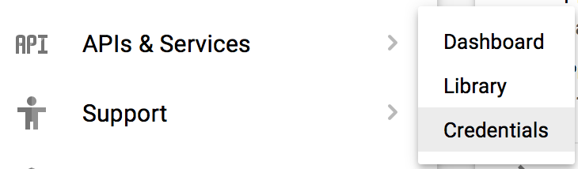
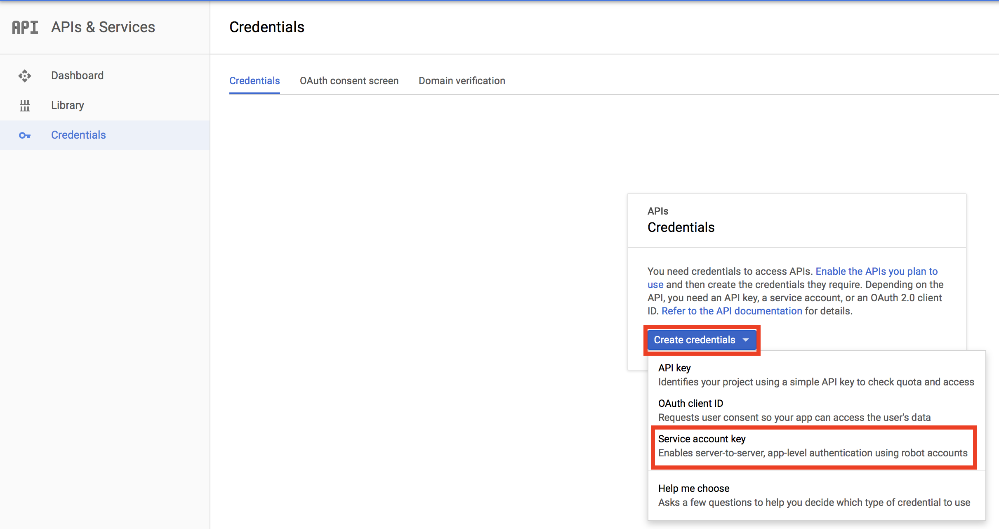
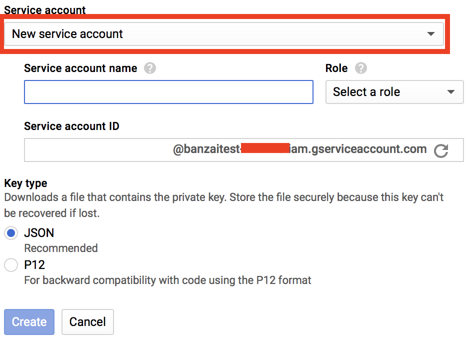
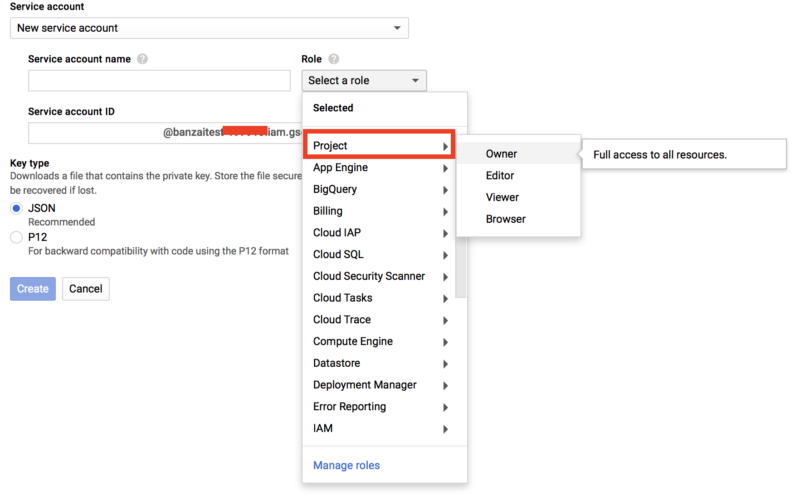
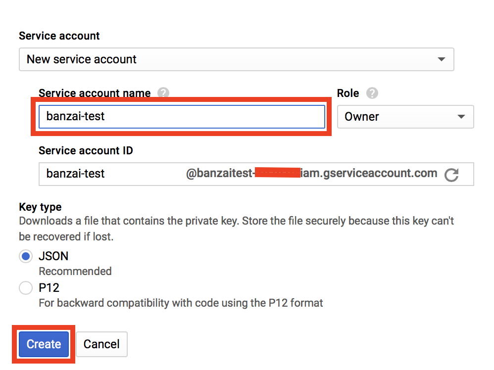

# Hosting Pipeline Control Plane on Google Cloud

Follow the steps below for hosting `Pipeline Control Plane` on `Google Cloud`.

## Pre-requisites

### Create new Project
To create a ControlPlane within your Google Container Engine (GKE), a project must be set up. To do that please follow this [link](https://console.cloud.google.com/getting-started?ignorePreviousPage).

> If you don't signed up for GKE yet, please hit the "Sign up for free trial", this will allow you to try GKE out.
<a href="images/GKECreateProject.png" target="_blank"></a>

Create a new `Project` or use the `My First Project` which is created by GKE by default. Click the `My First Project` to open the drop-down menu.

<a href="images/GKENewProject.png" target="_blank"></a>

In the menu use the `plus` button to create a new project.

<a href="images/AddNewProject.png" target="_blank"></a>

After filling the `Project name` field hit `Create` to continue

<a href="images/NewProject.png" target="_blank"></a>

When the Project is created, please choose it from the dropdown menu.

<a href="images/CreatedProject.png" target="_blank"></a>

### Enable Kubernetes Engine

We need to enable `Kubernetes Engine`, to do that click the Kubernetes Engine button in the menu.

<a href="images/KubernetesEngine.png" target="_blank"></a>

At first an error will be displayed, but don't worry at the background GKE is enabling the Kubernetes Engine for your project.

<a href="images/KubeError.png" target="_blank"></a>

### Create Credentials

Next, a credential has to be created, to do that find the `API & Services` in the menu and choose `Credentials`

<a href="images/CreateCreds.png" target="_blank"></a>

To create a credential click the Create credentials button

<a href="images/CredentialPage.png" target="_blank"></a>

A new `Service Account` has to be created, select New service account from the dropdown menu

<a href="images/NewServiceAccount.png" target="_blank"></a>

Choose the Project owner role for the Service account.

<a href="images/ProjectOwner.png" target="_blank"></a>

Specify your Service account name and hit `Create`.

<a href="images/CreateServiceAcc.png" target="_blank"></a>

This will save a json to your computer, that json can be used to interact with GKE so store it securely.

## Command line

For creating the control plane launcher through command line take a look at `.env.example` as a start to learn what environment variables are required by the `Makefile`.

* deploy - `make create-gcloud`
* delete - `make terminate-gcloud`

## Google Cloud Web Console

### Create ControlPlane cluster

Please create a new Kubernetes cluster in GKE by clicking `Kubernetes Engine` from the menu and choosing `Kubernertes Cluster`

<a href="images/CreateControlPlane.png" target="_blank"></a>

To create a cluster first choose the `Create cluster` button

<a href="images/CreateCluster.png" target="_blank"></a>

Then customize your cluster use the options showed by the picture below

<a href="images/CreateClusterDetailed.png" target="_blank"></a>
<a href="images/CreateClusterDetailedCreate.png" target="_blank"></a>

### Deploy Control Plane with Google Cloud Shell

To access the provided `Cloud Shell` click the *connect* button when the creation of the the cluster succeeded.

<a href="images/ConnectToCluster.png" target="_blank"></a>

In the popup window please choose `Run in Cloud Shell`

<a href="images/ConnectToClusterPopUp.png" target="_blank"></a>

If the Cloud Shell initialized hit enter, Shell will automatically provides the first command

<a href="images/FirstCommand.png" target="_blank"></a>

Next `Helm` needs to be installed, to do that please use the following command:

```
curl https://raw.githubusercontent.com/kubernetes/helm/master/scripts/get | bash
```
<a href="images/GetHelm.png" target="_blank"></a>

Create service account, clusterrole binging and init helm with the following commands:

```
kubectl -n kube-system create serviceaccount tiller
kubectl create clusterrolebinding tiller --clusterrole cluster-admin --serviceaccount=kube-system:tiller 
helm init --service-account=tiller
```

<a href="images/InitHelm.png" target="_blank"></a>

Add the `Banzaicloud` helm repo:

```
helm repo add banzaicloud-stable http://kubernetes-charts.banzaicloud.com
```
<a href="images/AddRepo.png" target="_blank"></a>

Install the controlplane helm chart:

```
helm install banzaicloud-stable/pipeline-cp \
--set=drone.server.env.DRONE_ORGS=<acme_org> \
--set=global.auth.clientid=<GITHUB_CLIENT_ID> \
--set=global.auth.clientsecret=<GITHUB_CLIENT>SECRET> \
--set=gkeCredentials.client_id=<GKE_CLIENT_ID> \
--set=gkeCredentials.client_secret=<GKE_CLIENT_SECRET> \
--set=gkeCredentials.refresh_token=<GKE_REFRESH_TOKEN> \
--set=gkeCredentials.type=<GKE_TYPE> \
--set=prometheus.ingress.password=<PROMETHEUS_INGRESS_PASSWORD> \
--set=grafana.server.adminPassword=<GRAFANA_PASSWORD> 
```

<a href="images/ControlPlaneInstall.png" target="_blank"></a>